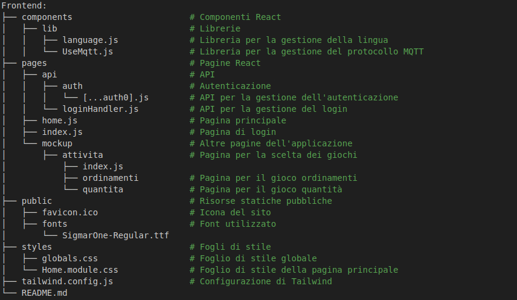

# SmarterGame

## Cos'è SmartGame

Lo SmartGame è una web app gamificata, utilizzata insieme ad uno strumento tangibile chiamato SMARTER. In questo scenario particolare, lo SMARTER e lo SmartGame vengono usati per aiutare e motivare i bambini dei primi anni delle elementari ad imparare la matematica. Data la flessibilità dello strumento, lo SMARTER può essere utilizzato anche in modalità cooperativa, affiancando due strumenti. In particolare, l’obiettivo è quello di studiare come due livelli differenti di interdipendenza positiva (due tipi differenti di cooperazione):
* Low Positive Interdipendence LPI
* High Positive Interdipendence HPI

possano motivare e divertire dei bambini di prima elementare alle prese con degli esercizi di matematica. Tramite la manipolazione degli SMARTER e della web app gamificata, può essere modificato il livello di interdipendenza tra bambini durante lo svolgimento degli esercizi.

## Layout della repository

<div align="center">
  
</div>

## Requirements

* [Node.js](https://nodejs.org/en) 16.8 o superiore
* Le dipendenze vengono gestite tramite [npm](https://pnpm.io/) (vedi [package.json](package.json))
* [Git](https://git-scm.com/)
* env.local file con le variabili d'ambiente (vedi [.env.local.example](.env.local.example))

## Per iniziare

Questo è un progetto [Next.js](https://nextjs.org/) avviato con [`create-next-app`](https://github.com/vercel/next.js/tree/canary/packages/create-next-app).

Clona il progetto (utilizzando https o ssh):
```bash
git clone
```

Entra nella cartella del progetto:
```bash
cd frontend
```

Installa le dipendenze:
```bash
npm install
# oppure
yarn install
# oppure
pnpm install
```

Assicurati di aver creato il file `.env.local` con le variabili d'ambiente necessarie.

Per avviare l'app in modalità sviluppo:

```bash
npm run dev
# or
yarn dev
# or
pnpm dev
```

Una volta lanciato il comando, apri [http://localhost:3000](http://localhost:3000) con il tuo browser per vedere il risultato.

## Deploy su Vercel

Per maggiori informazioni su come fare il deploy su Vercel, consulta la [documentazione di Next.js](https://nextjs.org/docs/deployment).

Un'istanza di questo progetto è disponibile su [SmartGame](https://frontend-taupe-kappa-35.vercel.app/).
